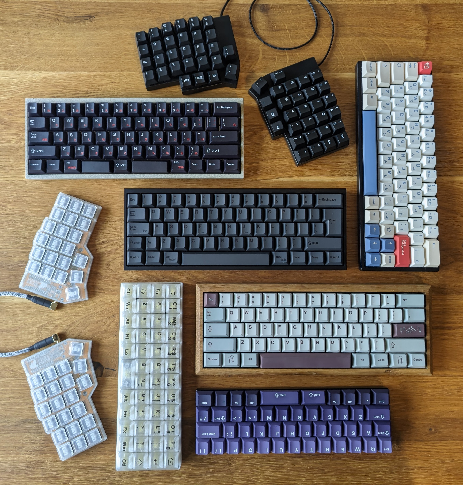

# QMK Userspace

A collection of QMK-based keyboards including STL files for 3D printing.

<p align="center">
  
<p>

## Keyboards

- Existing QMK keyboards
    - [crkbd/rev1](keyboards/crkbd/keymaps/srwi) - Corne keyboard with a transparent 3D-printed case and flat choc switches
    - [evyd13/plain60](keyboards/evyd13/plain60/keymaps/srwi) - 60% keyboard in a Tofu60 case with plate and stabilizers taken from an old Vortex Pok3r (ISO)
    - [ymdk/yd60mq #1](keyboards/ymdk/yd60mq/keymaps/srwi) - 60% keyboard in a wooden oak case with brass inlets
    - [ymdk/yd60mq #2](keyboards/ymdk/yd60mq/keymaps/srwi_split_spacebar) - 60% keyboard with split spacebar in concrete case (Tofu60 mold)
- Handwired
    - [srwi/like_lily58](keyboards/srwi/like_lily58) - 3D-printed & painted split keyboard inspired by the Lily58
    - [srwi/like_vortex_core](keyboards/srwi/like_vortex_core) - 3D-printed & painted 40% keyboard with a layout inspired by the Vortex Core
    - [srwi/like_planck](keyboards/srwi/like_planck) - 3D-printed fully transparent RGB keyboard with 3D-printed keycaps and a layout like the Planck keyboard
    - [srwi/silicone60](keyboards/srwi/silicone60) - Handwired 60% keyboard embedded inside of a silicone mold

## Building custom/handwired keyboards

Regular QMK userspace does not support custom/handwired keyboards. For being able to build them anyway, we need to clone the qmk firmware repository here, configure it for use with this userspace, and add the custom keyboard keymaps before building:

### Building with GitHub Actions

Keyboard firmwares will be built automatically on push to the repository and uploaded as workflow artifacts.

### Building manually

In Codespaces `.devcontainer/setup.sh` will be run automatically to set up the environment for compiling custom/handwired keyboards. Locally, the corresponding setup needs to be done manually.

Once everything is set up there are mostly three scenarios:

- **Building custom/handwired keyboards**: Custom/handwired keyboards have to be built using the python script `compile_keyboard.py` which will copy the vendor directory into the qmk_firmware clone before building:

    ```sh
    python compile_keyboard.py --keyboard <keyboard> --keymap <keymap> [--overwrite]
    ```

    Currently the only custom vendor is `srwi`, but it can be extended by adding more vendors to `CUSTOM_VENDOR_FOLDERS` in `compile_keyboard.py`.

- **Building existing vendor keyboards**: Existing vendor's keyboards can be built normally using the qmk cli or the `compile_keyboards.py` script.

- **Building all userspace keyboards**: Before building all keyboards using `qmk userspace-compile`, the `srwi` vendor directory needs to be copied into the qmk firmware directory using `cp -r keyboards/srwi qmk_firmware/keyboards/srwi`.
